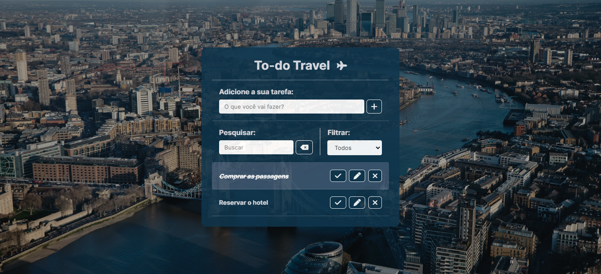

  <h3>To-do Travel ✈</h3>

  

## 💻 Projeto

Projeto desenvolvido com o objetivo de colocar em prática conhecimentos sobre JavaScript.

## ✨ Linguagens

- HTML;
- CSS;
- Javascript;

## 🛠 Funcionalidades

- Adicionar um item à lista;
- Marcar e desmarcar um item como feito;
- Editar o nome de um item;
- Remover um item da lista;
- Buscar por título;
- Filtrar por itens feitos e a fazer.

## Utilização do projeto

### 💾 Baixar o projeto

Faça o clone do repositório para ter uma versão do projeto em sua máquina: 
`$ git clone https://github.com/mmanaclara/todo-avancado.git`
